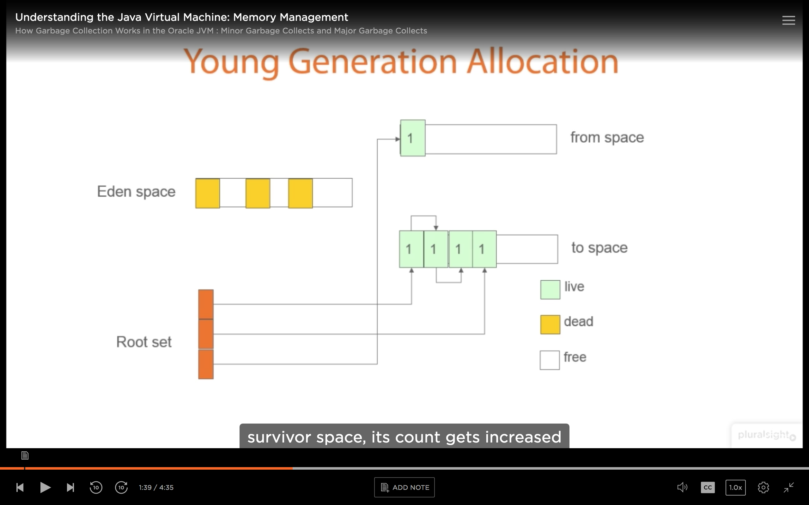

# Garbage Collection

## Introduction 

We learn how to interact with JVM externally i.e using tools given by JVM or internally using some classes provided by JVM.  

### Why GC?
Imagine,  
> Account acc = new Account();  
The question will arise who will delete this object? Creator or user?  

**1) CREATE AND FORGET:**  
No need to remember to delete. GC will do it. We don't need to free the memory as in C++ and C.  

**2) USE AND FORGET:**  
No need to ask "Should I delete ?"  

> Account acc = getAccount();  
Thus either the receiver or the giver of acc object can delete i.e the class that implements getAccount()  

If neither deletes it -> memory leak  
In C++ the method who is getting this object need to free the memory, so the user of object need to have in mind when to delete object but in java the user does not need to think about object freeing while using an object
If both delete it -> null pointer exception somewhere else which will be very hard to track.  

**3) USE WITH CONFIDENCE:**   
Objects will not vanish or corrupt behind your back. In C++ some other thread may delete the object which will create null ptr exception later.

### GC PROMISE  
- Claim no live objects  
- No promise about dead objects.  
So dead objects may be present in memory. BUT no live object will be deleted or reclaimed. 
We don't know when GC will run, whether it will run before our application ends or not.

### Different Types of Garbage Collection
There are different types of GARBAGE COLLECTORS -  
**1) Do nothing** - Not freeing any memory. Just guarenting that no live objects will be reclaimed.

**2) Reference Counting** - for a variable two functions - 
    - addReference - increment reference count. 
    - release - decrements reference count. 
When reference count reaches zero, object can clean itself up. In this we’ll not be able to delete cyclic references.

**3) Mark and sweep** - Has 2 phases ....Mark phase walks through all live memory marking it alive and sweep phase removes all unused memory. This leads us to memory which can be fragmented. Compaction is done by rearranging the marked memory.

**4) Copying** - Work hand in hand with mark and sweep garbage collection. Marked objects are copied to a buffer (new space) before sweep phase runs on the old space, hence the memory is no longer fragmented.

**5) Generational** - If an object survives one GC, then GC would not look at it again for a while. This improves performance of GC.

**6) Incremental** - Does not look at all the memory all the time during Garbage collect. so kinda like Generational.

So GC are of many types. So we tend to have a mixture of all these.  

Now let's have a look at some of these in detail.  

### Reference Counted Garbage Collection
In reference counting, we have a problem of circular references where an object1 references object 2 and object2 also references object1 and they have no external reference. This is also known as Island of Isolation.  
These cyclic references won't be removed, although there is no reference that can be used to access these objects.

### Mark and Sweep GCs

Typically 3 phases -  
**MARK** - Identifying objects still in use.
Start from the root set and following other references from nodes of memory, GC mark the live memory.
In case of cycle in memory and not reference from root set .. No problem because we’ll not be able to reach that cycle as no external references.

**SWEEP** - Removes unused objects.

**COMPACT** - To compact the memory. So physical addresses of memory changed. a references rearranged accordingly in root set
In java we don't have physical addresses of memory. Objects internally manages them.

### Copying GCs 

Things are a little different.
When memory for a buffer gets full. GC run and mark live memory.

Then it copies it to other buffer and rearranges references in root set.

Then removes dead memory from previous memory.

After the copy and compaction, we end up with a compacted copy of the data in new space data and a (hopefully) large, contiguous area of memory in new space in which we can quickly and easily allocate new objects.
The next time we do garbage collection (i.e when the space in which we are allocating memory from now gets full), the roles of old space (from space) and new space (to space) will be reversed.

### Generational GCs

GENERATIONAL COLLECTORS
There are different generations - Younger , older.  
Idea is once an object survives one GC. it is promoted to a different generation.  
And GC will sweep through the younger generation more often than the older generation.  

Let's see how thihs happens:  
So in young generation we have allocated memory. We have old generation, where there maybe alive maynot be alive.
Once GC runs, the survivors of that are moved to old generation.

And diff environment have diff number of generations. 
Java has two: Young and old generations.
.Net has three.

## How Garbage Collection Works in the Oracle JVM

### Introducing the Players

Stop the world events - its when GC pauses the entire application and at that point it collects garbage. We want to try and minimise these events.
Memory fragmentation - Does GC Defragments memory all at one or leave it for later stage. or it leaves memory fragmented on the basis that it may lead to lower cost than defragment it.
Throughput - how quickly can GC run, How quickly can it collect garbage and how it effects behaviour of application.
We also need to think about is if you are running on a multi core machine, So can GC run in parallel with application . Java provides these types of GC as well.

### The Basics of Garbage Collection in the Java Virtual Machine

JVM Has Young and old gen.

Young Generation:  
Eden space - where most initial objects allocated.
When one GC happens objects are copied to new survivor space and objects in original survivor space also gets copied into this new survival space. So all objects surviving Gc live in one of these survivor spaces.

Old Generation:   
when an object survives number of GCs. Then runtime decides that that object will essentially live forever. and move it to the old generation.  

Permanent Space - here live things used by Java runtime. Things like class information is stored here. This is never GCied.

### Minor Garbage Collects and Major Garbage Collects

Minor Garbage collection - When GC collects objects in Young generation.

Major garbage collection - When old generation is full. It is slow as Major GC has to go through large sections of heap. It's also possible that, The memory allocated had been paged. So it has again to be paged back in
Its also possible to allocate objects directly into the old generation. No direct way of doing it. But we can set option on the JVM called PretenureSizeThreshold. 

### How Allocations Work in the Java Virtual Machine
How does the allocation of Memory happens in java
allocate and incr pointer.
But in multithreaded environment two threads may compete for the same piece of memory. So we'll be needing locks and locks are expensive. So TLABS used..

### What Is a Cardtable and How Is It Used in Garbage Collection
 JVM STACK AREA 
For every thread, JVM creates a separate stack at the time of thread creation. The memory for a Java Virtual Machine stack does not need to be contiguous. The Java virtual machine only performs two operations directly on Java Stacks: it pushes and pops frames. And stack for a particular thread may be termed as Run – Time Stack. Each and every method call performed by that thread is stored in the corresponding run-time stack including parameters, local variables, intermediate computations, and other data. After completing a method, corresponding entry from the stack is removed. After completing all method calls the stack becomes empty and that empty stack is destroyed by the JVM just before terminating the thread. The data stored in the stack is available for the corresponding thread and not available to the remaining threads. Hence we can say local data is thread safe. Each entry in the stack is called Stack Frame or Activation Record.  

The Java stack is composed of stack frames (or frames). A stack frame contains the state of one Java method invocation. When a thread invokes a method, the Java virtual machine pushes a new frame onto that thread's Java stack. When the method completes, the virtual machine pops and discards the frame for that method.  

What does live in live objects mean ?  
Live roots -  
1) if reference coming from stack frame they must be live.  
2) Static variables - not part of an instance . kinda global. So should be kept live.  
3) if using Java Native interface (JNI) or synch monitors doing locking , Those are also live  

**What objects are kept live during GC ?**  
So any object with reference form live root is kept live during GC.
ref from live rooted objects are also kept live
if refs from old gen to young ones, they are also kept live. Why? Because there might be an object in the old generation whose reference has been destroyed, but since it’s present in the old gen, therefore all the objects in the young generation that are referred from this old gen object must be preserved.

But how. Does it scans old gen space .. No.. Uses CArd tables.

My understanding is that an entry in the card table is set when an object in young generation is allocated that is referenced by something in the old generation
When a write to a reference (to an object in young generation) happens, These writes go through something called write barrier.
And this write barries triggers code in JVM, this code updates an entry in a table called card table
So minor GC sees card table and load the memory corresponding to references present in card table and follow references in that memory , to mark them in use.

###  Serial Versus Parallel Garbage Collectors

(https://www.cubrid.org/blog/understanding-java-garbage-collection)  

